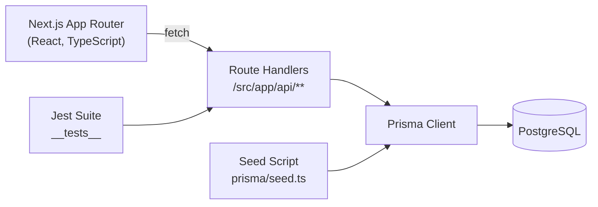
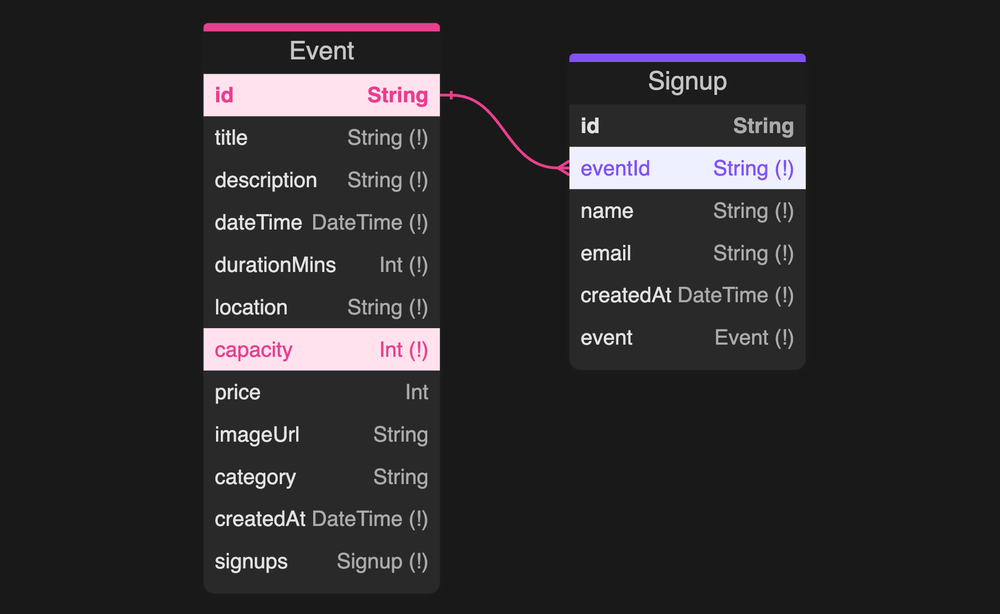

# Events Platform

**Author:** Bradley Mattison

> Community-driven events hub where staff publish happenings and attendees register with ease.

---

## Overview
- Curated catalogue of upcoming events backed by PostgreSQL and Prisma.
- Public REST APIs powering event listings, detail pages, and attendee signups.
- TypeScript-first Next.js App Router project with automated data seeding and Jest integration tests.

### Core Features
| Domain        | Capabilities |
| ------------- | ------------ |
| Events        | List, sort, and retrieve detailed event information, including computed start/end times and optional pricing. |
| Signups       | Collect attendee name + email with shared Zod validation, duplicate-protection, and Google Calendar hand-off. |
| UX            | Live form feedback, success state with calendar integration, and responsive theming (light/dark toggle). |
| Operations    | Deterministic seed data plus Jest-backed API/DB integration tests. |

### Recent Enhancements
- Responsive signup panel with client-side Zod validation, inline errors, and success messaging.
- Authentic “Add to Google Calendar” CTA using Google’s official icon and button styling.
- Event DTOs now expose `startTime`, `endTime`, and `endDateTime` for richer UI formatting (asserted in Jest).
- Dark mode toggle in the header wired to the design token system, plus footer branding links.

### Architecture At A Glance


---

## Tech Stack
- Next.js 15 (App Router, Node.js runtime) + React 19.
- TypeScript with strict Prisma typings for the data layer.
- Prisma ORM targeting PostgreSQL, bundled seed generator with Faker.
- Jest 30 for API and database integration tests.
- Tailwind/PostCSS toolchain ready for UI work.

---

## Getting Started

### 1. Prerequisites
- Node.js 20+ and npm.
- Local PostgreSQL instance (default connection uses `postgres` user with no password).
- Git for cloning and version control.

### 2. Clone & Install
```bash
git clone <YOUR_FORK_URL>
cd events-platform
npm install
```

### 3. Environment Variables
Create `.env` and `.env.test` (copied from the examples below) and update connection strings if needed.
```dotenv
# .env
DATABASE_URL="postgresql://postgres@localhost:5432/events_platform_db?schema=public"
ADMIN_PASSWORD="dev-admin-secret"

# .env.test
DATABASE_URL="postgresql://postgres@localhost:5432/events_platform_test_db?schema=public"

# .env.prod (not committed; used locally when preparing Supabase)
# Supabase → Project → Settings → Database → Connect → ORMs → "Connection pooling"
# Host looks like aws-1-region.pooler.supabase.com:6543 and the user is postgres.<project-ref>
DATABASE_URL="postgresql://postgres.<project-ref>:<password>@aws-1-<region>.pooler.supabase.com:6543/postgres?pgbouncer=true&sslmode=require"
ADMIN_PASSWORD="production-secret"
NODE_ENV=production
SEED_SIZE=1
```

For production, mirror `DATABASE_URL` and `ADMIN_PASSWORD` in your hosting provider before deploying. The `.env.prod` file is only for running Prisma commands locally against Supabase—never commit it. Using the pooled connection string keeps serverless environments from spinning up a brand-new Postgres connection on every request.

### 4. Database Provisioning
```bash
# Apply migrations and seed development data
npm run db:dev:refresh

# (Optional) Prep the dedicated test database
npm run db:test:refresh
```
The seed script creates 34 realistic events and attaches 1–20 signups per event, giving meaningful data for local development and tests.

### 5. Start Developing
```bash
npm run dev
```
Visit `http://localhost:3000` to browse events once the frontend is built out. API endpoints are available immediately under `http://localhost:3000/api/...`.

### 6. (Optional) Install shadcn/ui primitives
The UI layer uses components generated via [shadcn/ui](https://ui.shadcn.com/). On a fresh setup, run:
```bash
npx shadcn@latest init
npx shadcn@latest add button card input label
```
Those commands populate `components.json` and ensure the files under `src/components/ui/` match the canonical versions. They rely on dependencies already listed in `package.json` (`class-variance-authority`, `tailwind-merge`, `clsx`, etc.).

---

## Available Scripts

| Command | Purpose |
| ------- | ------- |
| `npm run dev` | Start Next.js in development mode (Turbopack). |
| `npm run build` | Create an optimized production build. |
| `npm run start` | Serve the built application. |
| `npm run lint` | Run ESLint against the project. |
| `npm run prisma:gen` | Regenerate the Prisma Client after schema changes. |
| `npm run db:dev:deploy` | Apply pending migrations to the development database. |
| `npm run db:dev:reset` | Drop and recreate the dev database schema (non-interactive). |
| `npm run db:dev:seed` | Execute the Prisma seed against the dev database. |
| `npm run db:dev:refresh` | Reset, migrate, and seed the dev database in one command. |
| `npm run db:studio:dev` | Launch Prisma Studio connected to the dev database. |
| `npm run test` | Run the Jest suite with `.env.test`. |
| `npm run test:watch` | Run Jest in watch mode. |
| `npm run db:test:deploy` | Apply migrations to the test database. |
| `npm run db:test:reset` | Drop and recreate the test database schema. |
| `npm run db:test:seed` | Seed the test database. |
| `npm run db:test:refresh` | Reset, migrate, and seed the test database in one command. |
| `npm run db:studio:test` | Launch Prisma Studio connected to the test database. |
| `npm run db:prod:deploy` | Apply migrations to the production database using `.env.prod`. |
| `npm run db:prod:seed` | Run the seed script against production (requires `SEED_SIZE`). |
| `npm run db:prod:prepare` | Deploy migrations, then seed production in sequence. |

---

## API Reference
All endpoints return JSON and assume the Node.js runtime.

### `GET /api/events`
- Returns all events ordered by `dateTime` ascending.
- **Success (`200`)**: JSON array of `AppEvent` objects including derived fields (`endDateTime`, `startTime`, `endTime`, `available`).
- **Failure (`500`)**: `{ "message": "Internal server error" }` for unexpected issues.

### `GET /api/events/{id}`
- Fetch a single event by UUID (same shape as the list response).
- **Not found (`404`)**: `{ "message": "Event {id} not found" }`.

### `POST /api/events`
- Create a new event (consumed by the admin UI).
- **Request body**:
  ```json
  {
    "title": "API Route Event",
    "description": "Created via admin UI",
    "dateTime": "2026-07-20T14:00:00.000Z",
    "durationMins": 120,
    "location": "Main Hall",
    "capacity": 50,
    "price": 25,
    "imageUrl": "https://example.com/image.png",
    "category": "Community"
  }
  ```
- **Created (`201`)**: Returns the persisted event (`AppEvent` shape).
- **Validation failure (`400`)**: `{ "message": "Invalid request parameters", "issues": [...] }`.
- **Other failures (`500`)**: `{ "message": "Internal server error" }`.
> Server-side auth is not yet enforced; the admin UI gate relies on the `ADMIN_PASSWORD` cookie.

### `POST /api/events/{id}/signup`
- Submit a signup for an event.
- **Success (`201`)**: Created signup record with `id`, `eventId`, `name`, `email`, `createdAt`.
- **Validation failure (`400`)**: `{ "message": "Invalid request body", "issues": [...] }`.
- **Not found (`404`)**: `{ "message": "Event {id} not found" }`.
- **Duplicate (`409`)**: `{ "error": "Duplicate entry" }` when the same email already exists for the event.
- **Other failures (`500`)**: `{ "error": "Internal server error" }`.

All API handlers sit under `src/app/api/**`, share Zod validation defined in `src/server/schema/events.ts`, and translate database errors via `src/lib/handlePrismaError.ts`.

## Hosting Notes
- Deploy on platforms like Vercel. Define `DATABASE_URL` and `ADMIN_PASSWORD` in the project’s environment variables before building.
- Point `DATABASE_URL` at a managed Postgres instance (e.g., Supabase). Then run `npm run db:prod:prepare` locally (with `.env.prod` configured) to push migrations + seed data into Supabase before redeploying.
- Image upload currently accepts URLs; integrate object storage later if direct uploads are required.

## Data Model
| Event Field | Type | Notes |
| ----------- | ---- | ----- |
| `id` | `String` | UUID primary key. |
| `title`, `description`, `location` | `String` | Core content fields. |
| `dateTime`, `endDateTime` | `DateTime` | UTC timestamps for start and end. |
| `startTime`, `endTime` | `String` | Preformatted `HH:mm` helpers for UI rendering. |
| `price` | `Int?` | Optional ticket cost in whole currency units (null for free events). |
| `durationMins`, `capacity` | `Int` | Capacity used to enforce limits (future enhancement). |
| `imageUrl`, `category` | `String?` | Optional metadata for richer UI. |
| `createdAt` | `DateTime` | Default `now()`. |

| Signup Field | Type | Notes |
| ------------ | ---- | ----- |
| `id` | `String` | UUID primary key. |
| `eventId` | `String` | FK → `Event.id`. |
| `name`, `email` | `String` | Email is unique per event (`@@unique([eventId, email])`). |
| `createdAt` | `DateTime` | Default `now()`. |

### Entity Relationship Overview


`Signup.eventId` is the foreign key referencing `Event.id`, giving each event many signups while every signup points back to a single event.

---

## Project Layout
```
.
├── src/
│   ├── app/
│   │   ├── api/
│   │   │   ├── events/route.ts
│   │   │   ├── events/[id]/route.ts
│   │   │   └── events/[id]/signup/route.ts
│   │   ├── events/
│   │   │   ├── components/
│   │   │   │   ├── EventFilterBar.tsx
│   │   │   │   └── EventGrid.tsx
│   │   │   └── page.tsx
│   │   ├── events/[id]/
│   │   │   ├── components/
│   │   │   │   ├── EventDetailHeader.tsx
│   │   │   │   ├── EventQuickFacts.tsx
│   │   │   │   └── SignupPanel.tsx
│   │   │   └── page.tsx
│   │   ├── layout.tsx
│   │   └── page.tsx
│   ├── components/
│   │   ├── EventCard.tsx
│   │   ├── PageHero.tsx
│   │   └── ui/
│   │       ├── button.tsx
│   │       ├── card.tsx
│   │       ├── input.tsx
│   │       └── label.tsx
│   ├── lib/
│   │   ├── handlePrismaError.ts
│   │   ├── prisma.ts
│   │   ├── types.ts
│   │   └── utils.ts
│   └── server/
│       ├── errors.ts
│       ├── schema/
│       │   └── events.ts
│       └── services/
│           └── events.service.ts
├── prisma/
│   ├── schema.prisma
│   └── seed.ts
└── __tests__/
    ├── api/
    └── db/
```

---

## Testing & Quality
- `npm run test` executes API contract tests and Prisma model assertions with a dedicated test database.
- `__tests__/api` covers happy-path and failure cases for each route handler.
- `__tests__/db` validates seeding, constraints (unique email per event), and referential integrity.
- Ensure the test database is refreshed (`npm run db:test:refresh`) if schema or seed data changes.

---

## Development Workflow Tips
- Run `npm run prisma:gen` after editing `prisma/schema.prisma`.
- Use `npm run db:dev:refresh` after migrations to keep seed data aligned.
- Prisma Studio (`npm run db:studio:dev`) offers a quick GUI for inspecting events and signups.
- Keep `.env.test` synchronized with `.env` changes so tests reflect production-like settings.
- Theme tokens for shadcn components live in `src/app/globals.css` (`--primary`, `--accent`, etc.). Adjust those once to recolour the entire UI—the header toggle flips between light/dark palettes automatically.
- When you need additional shadcn primitives, use the CLI (`npx shadcn@latest add …`) so `components.json` and generated files stay in sync.
- Shared database logic lives under `src/server/services`. API routes validate via Zod (`src/server/schema`) and translate service errors (`src/server/errors`) into HTTP responses—reuse the same helpers inside server components for consistency.

---

## Roadmap Ideas
- Event creation & management UI for staff.
- Calendar integration (Google/ICS downloads) post-signup.
- Capacity enforcement and waitlist handling.
- Email notifications and attendee management dashboard.

---

## Troubleshooting
| Symptom | Fix |
| ------- | --- |
| `P1001` Prisma connection errors | Verify PostgreSQL is running and connection string credentials match. |
| Tests hang on teardown | Ensure the test database URL points to an isolated schema and Prisma disconnects successfully. |
| Seed script exits immediately | Check `NODE_ENV`; in production it intentionally no-ops unless `SEED_SIZE` is set. |

---

Happy building!
