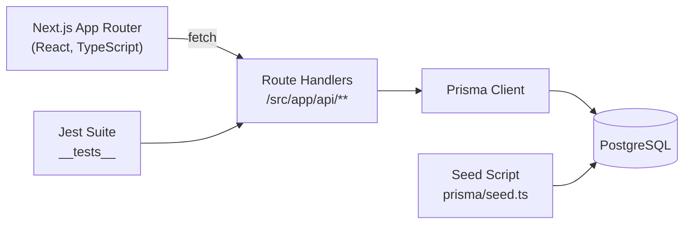

# Events Platform

**Author:** Bradley Mattison

> Community-driven events hub where staff publish happenings and attendees register with ease.

---

## Overview
- Curated catalogue of upcoming events backed by PostgreSQL and Prisma.
- Public REST APIs powering event listings, detail pages, and attendee signups.
- TypeScript-first Next.js App Router project with automated data seeding and Jest integration tests.

### Feature Highlights
| Domain        | Capabilities |
| ------------- | ------------ |
| Events        | List, sort, and retrieve detailed event information. |
| Signups       | Collect attendee name + email per event with duplicate protection. |
| Operations    | Deterministic seed data for demos and automated tests. |

### Architecture At A Glance


---

## Tech Stack
- Next.js 15 (App Router, Node.js runtime) + React 19.
- TypeScript with strict Prisma typings for the data layer.
- Prisma ORM targeting PostgreSQL, bundled seed generator with Faker.
- Jest 30 for API and database integration tests.
- Tailwind/PostCSS toolchain ready for UI work.

---

## Getting Started

### 1. Prerequisites
- Node.js 20+ and npm.
- Local PostgreSQL instance (default connection uses `postgres` user with no password).
- Git for cloning and version control.

### 2. Clone & Install
```bash
git clone <YOUR_FORK_URL>
cd events-platform
npm install
```

### 3. Environment Variables
Create `.env` and `.env.test` (copied from the examples below) and update connection strings if needed.
```dotenv
# .env
DATABASE_URL="postgresql://postgres@localhost:5432/events_platform_db?schema=public"

# .env.test
DATABASE_URL="postgresql://postgres@localhost:5432/events_platform_test_db?schema=public"
```

### 4. Database Provisioning
```bash
# Apply migrations and seed development data
npm run db:dev:refresh

# (Optional) Prep the dedicated test database
npm run db:test:refresh
```
The seed script creates 34 realistic events and attaches 1–20 signups per event, giving meaningful data for local development and tests.

### 5. Start Developing
```bash
npm run dev
```
Visit `http://localhost:3000` to browse events once the frontend is built out. API endpoints are available immediately under `http://localhost:3000/api/...`.

---

## Available Scripts
| Command | Purpose |
| ------- | ------- |
| `npm run dev` | Start Next.js in development mode (Turbopack). |
| `npm run build` / `npm run start` | Production build and serve. |
| `npm run lint` | Run ESLint against the project. |
| `npm run prisma:gen` | Regenerate Prisma client. |
| `npm run db:dev:refresh` | Reset, migrate, and seed the dev database. |
| `npm run db:test:refresh` | Reset, migrate, and seed the test database. |
| `npm run test` | Execute the Jest suite using `.env.test`. |
| `npm run test:watch` | Watch mode for Jest tests. |

---

## API Reference
All endpoints return JSON and assume the Node.js runtime.

### `GET /api/events`
- **Description**: Retrieve all events sorted by `dateTime` ascending.
- **Response `200`**:
```json
[
  {
    "id": "6e4a925d-52ad-4ff0-8e8d-414d16db2c61",
    "title": "Coffee Morning Meetup",
    "description": "Join us for a relaxed morning of coffee and conversation.",
    "dateTime": "2024-07-10T09:00:00.000Z",
    "durationMins": 90,
    "location": "Greenwood Community Center",
    "capacity": 30,
    "imageUrl": "https://images.unsplash.com/photo-1517224215055-34e33205d461?...",
    "category": "Community",
    "createdAt": "2024-06-01T12:00:00.000Z"
  }
]
```

### `GET /api/events/{id}`
- **Description**: Fetch a single event by UUID.
- **Path Parameters**: `id` (string, UUID of the event).
- **Responses**:
  - `200`: Event object identical to the listing format.
  - `404`: `{ "error": "Event Not found" }` when the UUID does not exist.

### `POST /api/events/{id}/signup`
- **Description**: Create a signup for the specified event.
- **Request Body**:
```json
{
  "name": "Ada Lovelace",
  "email": "ada@example.com"
}
```
- **Responses**:
  | Status | Body |
  | ------ | ---- |
  | `201` | Created signup record including generated `id` and `createdAt`. |
  | `400` | `{ "message": "Missing name or email" }` when required fields are absent. |
  | `404` | `{ "error": "Related record not found" }` if the event is missing. |
  | `409` | `{ "error": "Duplicate entry" }` when the email already registered for the event. |
  | `500` | `{ "error": "Internal server error" }` for uncaught issues. |

All API handlers delegate to Prisma and share a centralized error translator (`src/lib/handlePrismaError.ts`) ensuring consistent HTTP responses.

---

## Data Model
| Event Field | Type | Notes |
| ----------- | ---- | ----- |
| `id` | `String` | UUID primary key. |
| `title`, `description`, `location` | `String` | Core content fields. |
| `dateTime` | `DateTime` | Indexed for chronological ordering. |
| `durationMins`, `capacity` | `Int` | Capacity used to enforce limits (future enhancement). |
| `imageUrl`, `category` | `String?` | Optional metadata for richer UI. |
| `createdAt` | `DateTime` | Default `now()`. |

| Signup Field | Type | Notes |
| ------------ | ---- | ----- |
| `id` | `String` | UUID primary key. |
| `eventId` | `String` | FK → `Event.id`. |
| `name`, `email` | `String` | Email is unique per event (`@@unique([eventId, email])`). |
| `createdAt` | `DateTime` | Default `now()`. |

---

## Project Layout
```
.
├── src/
│   ├── app/
│   │   ├── api/
│   │   │   ├── events/route.ts
│   │   │   ├── events/[id]/route.ts
│   │   │   └── events/[id]/signup/route.ts
│   │   └── page.tsx
│   └── lib/
│       ├── handlePrismaError.ts
│       └── types.ts
├── prisma/
│   ├── schema.prisma
│   └── seed.ts
└── __tests__/
    ├── api/
    └── db/
```

---

## Testing & Quality
- `npm run test` executes API contract tests and Prisma model assertions with a dedicated test database.
- `__tests__/api` covers happy-path and failure cases for each route handler.
- `__tests__/db` validates seeding, constraints (unique email per event), and referential integrity.
- Ensure the test database is refreshed (`npm run db:test:refresh`) if schema or seed data changes.

---

## Development Workflow Tips
- Run `npm run prisma:gen` after editing `prisma/schema.prisma`.
- Use `npm run db:dev:refresh` after migrations to keep seed data aligned.
- Prisma Studio (`npm run db:studio:dev`) offers a quick GUI for inspecting events and signups.
- Keep `.env.test` synchronized with `.env` changes so tests reflect production-like settings.

---

## Roadmap Ideas
- Event creation & management UI for staff.
- Calendar integration (Google/ICS downloads) post-signup.
- Capacity enforcement and waitlist handling.
- Email notifications and attendee management dashboard.

---

## Troubleshooting
| Symptom | Fix |
| ------- | --- |
| `P1001` Prisma connection errors | Verify PostgreSQL is running and connection string credentials match. |
| Tests hang on teardown | Ensure the test database URL points to an isolated schema and Prisma disconnects successfully. |
| Seed script exits immediately | Check `NODE_ENV`; in production it intentionally no-ops unless `SEED_SIZE` is set. |

---

Happy building!
